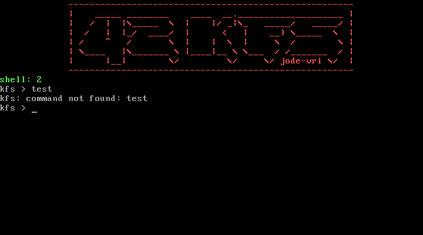

# KFS

KFS is a small educational x86 kernel written from scratch in C and NASM
assembly. It boots through GRUB, initializes protected-mode structures and
provides a VGA text interface with keyboard input and four virtual terminals.

The project was originally developed at 42 Paris in December 2023. This branch
preserves that work while adding a reproducible build, runtime checks,
documentation and targeted correctness fixes.



## Features

- 32-bit x86 freestanding kernel
- GRUB Multiboot entry point and custom linker script
- Global Descriptor Table (GDT)
- Interrupt Descriptor Table (IDT) and PIC remapping
- PS/2 keyboard interrupt handling
- VGA text output with scrolling
- Four virtual terminals, selected with `F1` to `F4`
- Minimal kernel-side C library
- Interactive shell
- Memory and stack inspection helpers

The shell currently supports:

- `stack`: display the active kernel stack
- `reboot`: reboot the virtual machine
- `shutdown`: power off the virtual machine
- `Ctrl+L`: clear the current terminal

## Build

KFS is validated on Debian 13 under WSL2. On Debian or Ubuntu, install:

```sh
sudo apt-get update
sudo apt-get install \
  build-essential gcc-multilib binutils nasm \
  grub-pc-bin grub-common xorriso mtools \
  qemu-system-x86 qemu-utils
```

Build the kernel and bootable ISO:

```sh
make
```

Validate the Multiboot header and ELF segment permissions:

```sh
make check
```

Run it interactively:

```sh
make run
```

Run the headless QEMU interaction check and produce a screen capture:

```sh
make smoke-test
```

## Architecture

```text
GRUB
 └─ Multiboot entry point
    └─ Kernel stack
       └─ kmain
          ├─ VGA terminal
          ├─ GDT
          ├─ IDT + PIC
          ├─ Keyboard IRQ
          └─ Shell
```

The source tree is divided into:

- `kernel/arch/i386`: boot, segmentation, interrupts, I/O and VGA code
- `kernel`: kernel entry point and shell
- `libk`: minimal freestanding runtime helpers
- `include`: public kernel headers
- `scripts`: headless QEMU checks and capture utilities

## Modernization work

The modernization pass keeps the original design and Git history while
addressing concrete maintenance issues:

- explicit kernel stack initialization at boot;
- correctly indexed kernel stack GDT descriptor;
- correct IDT limit (`size - 1`);
- correct PIC end-of-interrupt sequence for slave IRQs;
- bounded shell input and functional backspace handling;
- virtual-terminal-safe input routing;
- VGA scrolling instead of wrapping over existing output;
- separated ELF code and data segments, removing RWX load segments;
- deterministic Multiboot and headless QEMU checks.

More detail is available in
[`docs/modernization-notes.md`](docs/modernization-notes.md).

## Status

The kernel builds without warnings, passes the Multiboot/ELF checks, boots in
QEMU and accepts keyboard input on multiple virtual terminals. It remains an
educational kernel, not a production operating system.
